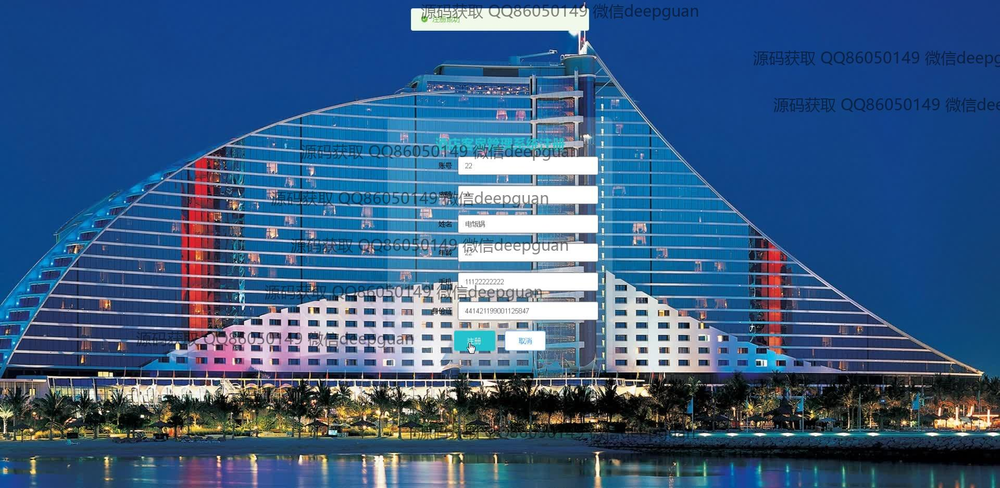

<h1 align="center">基于web的酒店客房管理系统</h1>

## 简介
基于Web的酒店客房管理系统：角色分为管理员和用户；功能包括用户管理、客房信息管理、预订与入住管理、以及在线客服交流。这些功能旨在提高酒店管理效率和用户体验。    --计算机毕业设计源码；毕设源码；java毕业设计源码

## 联系方式

<h3 align="center">获取完整代码与数据库文件 + 微信：deepguan QQ: 86050149 QQ群: 783742310</h3>

<h3 align="center">可帮忙远程部署 包运行成功！提供远程部署、修改代码、设计文档指导、代码讲解等服务！</h3>

## 功能介绍（完整见运行截图）
管理员：基本功能：登录，注册，退出。系统管理：用户管理、会员管理、客房信息管理、清洁人员管理、在线客服管理。客房管理：录入与编辑客房信息，包括房间号、类型、价格、图片、状态等。订单管理：查看和更新订单信息，支持预订、入住、退房管理，审核支付状态。个人中心：查看与修改管理员信息，查看操作日志。

清洁人员：登录系统后可查看系统分配的房间清扫任务。查看客房清洁状态，并更新完成情况。通过系统查看任务详情并反馈完成进度，提升清洁管理效率。

用户：基本功能：登录，注册，退出。个人中心：管理和更新个人信息，如姓名、手机号、身份证等。客房浏览：查看客房信息，包括房间号、类型、价格、状态、可定时间等。预订管理：查看与管理个人预订记录，包含查看订单详情、取消预约、支付操作。个人收藏：收藏喜欢的客房，便于下次快捷查找。

会员：基本功能与普通用户相同，但拥有更多折扣和特权服务。专属预订：享有提前预订和会员特价，查看专属推荐客房。会员信息管理：完善和查看个人会员信息，包括会员等级和积分。

## 运行截图

本代码来源于网络,仅供学习参考使用!

